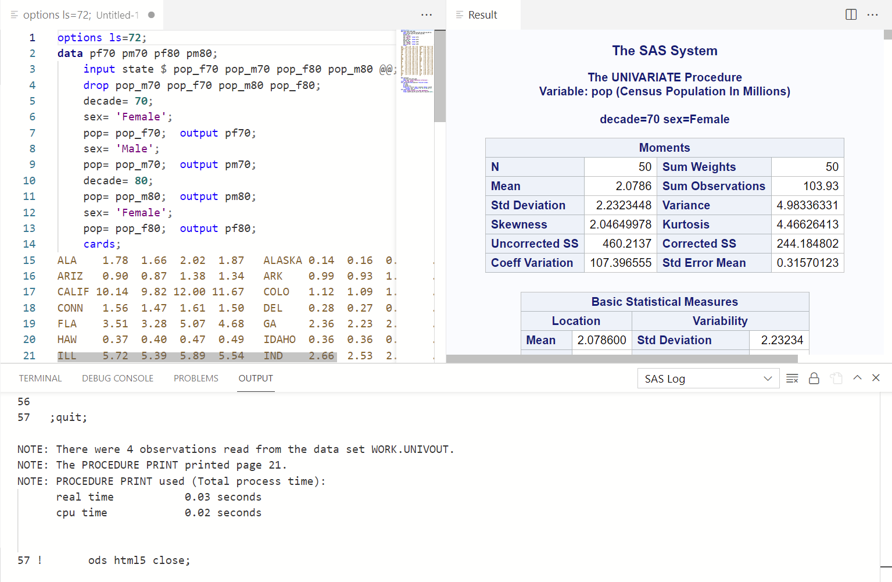

# SAS Extension for Visual Studio Code

This VS Code extension provides support for the [SAS language](https://www.sas.com), including features such as SAS syntax highlighting, code completion, hover help, code folding, outline, SAS code snippets and run SAS code.

## Features

### SAS Syntax Highlighting

Highlights the following syntax elements:

- Global statements
- SAS procedures
- SAS procedure statements
- Data step definition
- Data step statements
- SAS data sets
- Macro definition
- Macro statements
- Functions
- CALL routins
- Formats and informats
- Macro variables
- SAS colors
- Style elements and style attributes
- Comment
- Various constants
- Options, enumerated option values, sub-options and sub-option values for various procedure definitions and statements

Provides 3 color themes. Select one of them from `Manage > Color Theme` to gain colors for SAS syntax elements.

- SAS Illuminate (light theme)

- SAS Ignite (dark theme)

- SAS High Contrast

### Code completion and hover help

Provides code completion and mouse hover help for SAS keywords. The extension can display brief SAS syntax documents when you are editing your SAS code. You can display the help in any of the following ways:

- Move the mouse pointer over a valid SAS keyword in your code.
- Start to type a valid SAS keyboard, and move the mouse pionter over a suggested keyword in the autocompletion window.

The SAS language have overlapped keyword names that can be used in different contexts. For example, the LABEL keyword can be used both within the LABEL statement or as part of the LABEL= data set option. Our extension can tell the difference between them.

The SAS Product Document provides more comprehensive usage information about the SAS language, but our syntax help will give you the hint about the syntax or a brief description of a keyword. You can get additional help by clicking links in the syntax help.

The SAS Product Document is available on the SAS Customer Support Web site.

In the following example, the panel displays help for the data option in the PROC Print procedure.

Tip: Click the link on the help panel to navigate to the document.

### Snippets

The extension defines a lot of snippets for sas funcitons and procecures to help users input SAS code blocks. You can type the name of a function or procedure directly to show them. The first line of the below picture is a snippet.

### Code folding and outline

Provides code folding and outline for data steps, procedures, macro sections and user-defined regions.

Tip: Define custom region with `/*region*/` and `/*endregion*/`

### Run SAS code

Submit SAS code to Viya server.

- Before you run SAS code, please go to `Settings > Extensions > SAS` to configure your Viya server, Client ID/Secret and user name to login with password.

  - Please contact your SAS administrator for the Client ID and Client Secret. Refers to [Register a New Client ID](https://go.documentation.sas.com/doc/en/sasadmincdc/v_019/calauthmdl/p1gq6q7zzt52win1jwhc2b5kuc1z.htm#n0brttsp1nuzzkn1njvr535txk86).
  - Alternatively you can get access token by your own preferred way and store it in a file. Set the path to the token file in settings, the extension will use it.

- Click the Run icon on the top right on a SAS file.
- Enter password when prompted
- You'll see the SAS log and HTML output if any

- Notes
  - A session will be created the first time you run, which may take some time.
  - Currently only HTML output is supported to show. By default it will wrap `ods html5` to the code submitted. You can disable it by uncheck `Get ODS HTML5 output` in settings.
  - The code in "current" editor will be submitted. Please be sure to focus the editor you want before click the Run button.
  - You can run `Close current session` command to reset connection if anything wrong.
