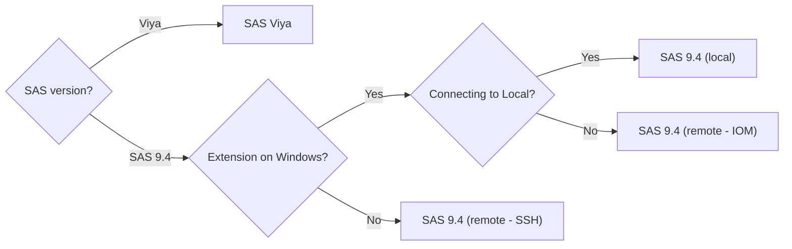

# Choose Connection Type

:::info

When doing [VS Code Remote Development](https://code.visualstudio.com/docs/remote/remote-overview), the SAS extension is running on the Remote OS.

:::

# Capabilities by Connection Type

| SAS Extension for Visual Studio Code - Capabilities by Connection Type |      SAS Viya      | SAS 9.4 (local)   SAS 9.4 (remote - IOM) | SAS 9.4 (remote - SSH) | Notes                                                                |
| ---------------------------------------------------------------------- | :----------------: | :------------------------------------------: | :--------------------: | -------------------------------------------------------------------- |
| SAS System Options settings                                            | :heavy_check_mark: |             :heavy_check_mark:\*             |   :heavy_check_mark:   | \*Startup options not supported for SAS 9.4 (local) and (remote-IOM) |
| Autoexec settings                                                      | :heavy_check_mark: |                     :x:                      |          :x:           |
| Access SAS Content                                                     | :heavy_check_mark: |                     :x:                      |          :x:           |
| Access connected libraries                                             | :heavy_check_mark: |              :heavy_check_mark:              |          :x:           |
| Table viewer                                                           | :heavy_check_mark: |              :heavy_check_mark:              |          :x:           |
| SAS Notebooks                                                          | :heavy_check_mark: |              :heavy_check_mark:              |   :heavy_check_mark:   |
| Convert SAS Notebook to SAS Studio Flow                                | :heavy_check_mark: |                     :x:                      |          :x:           |
| SAS syntax highlighting in SAS code                                    | :heavy_check_mark: |              :heavy_check_mark:              |   :heavy_check_mark:   |
| SAS errors, warnings, and notes highlighting in SAS log                | :heavy_check_mark: |              :heavy_check_mark:              |          :x:           | A SAS color theme is required.                                       |
| Code folding and code outline                                          | :heavy_check_mark: |              :heavy_check_mark:              |   :heavy_check_mark:   |
| Code completion                                                        | :heavy_check_mark: |              :heavy_check_mark:              |   :heavy_check_mark:   |
| Pop-up syntax help                                                     | :heavy_check_mark: |              :heavy_check_mark:              |   :heavy_check_mark:   |
| Snippets                                                               | :heavy_check_mark: |              :heavy_check_mark:              |   :heavy_check_mark:   |
| Able to cancel a running program                                       | :heavy_check_mark: |              :heavy_check_mark:              |          :x:           |
